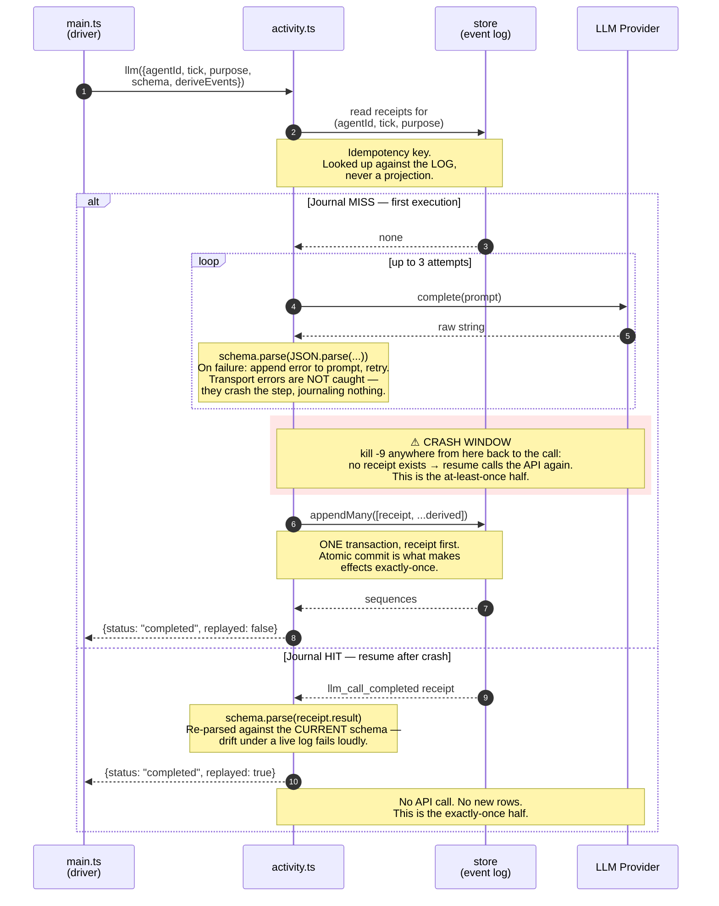
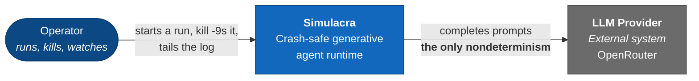
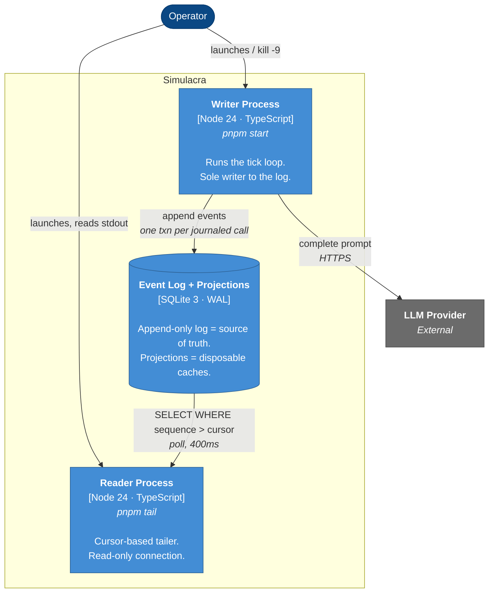
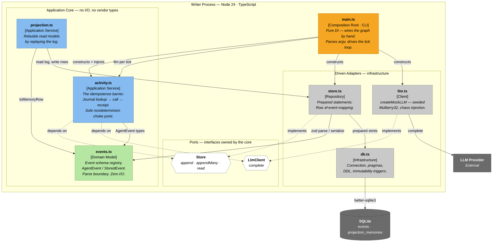
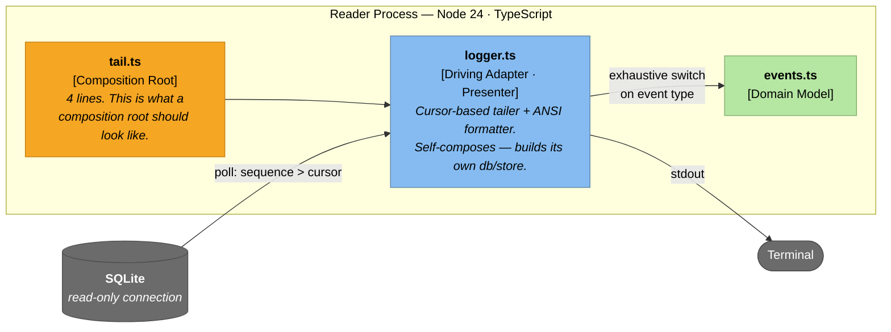

# Simulacra

**What is this repo?**
A crash-safe generative agent runtime built from first principles using an event-sourced, durable-execution core with a functional shell and flat modules. Nothing fancy. Framework-free. Minimal runtime dependencies. All in your terminal. Not a single GUI.

**Why did I build it?**
I wanted to develop my understanding of both distributed systems and AI agent harness engineering through a focussed example derived from an academic paper that I find genuinely fascinating: [Park et al. (2023)](https://arxiv.org/pdf/2304.03442)'s famous study of simulated agent societies.

**What is the opportunity?**
Their paper defined the architecture of believable agents — memory stream, reflection, planning — but did not address specific implementation details. This project is a first-principles implementation of their system built as a durable execution runtime that survives kill -9 mid-thought, never re-runs a side effect, and never loses a memory.

## 1. Execution

```bash
# T1: check app
pnpm compile
pnpm test

# T1: run the writer
pnpm db:drop && node src/main.ts --ticks 50 --chaos

# T2: run the reader
pnpm tail

# T3: kill -9
pkill -9 -f "src/main.ts"
## check DB
sqlite3 db/simulacra.sqlite3 "SELECT COUNT(*) FROM events;"

```





## 2. Architecture

### 2.1 System Principles
* Event-sourcing: immutable append-only log as a source of truth
  * One journal table `events` that records 1) in-world events 2) effect receipts.
  * One projection table `projection_memories` to deterministically rebuild in-world events from the event store on replay.
* Read side: CQRS-lite
  * Two composition roots in the project
    * `main.ts` is the write-side
    * `tail.ts` is the read side; no controller currently built.
* Execution: Durable Execution & Journalled Effects
  * Temporal `workflow` / `activity` split with receipts, at-least-once calls, and exactly-once effects.
* Module layout: functional core, imperative shell
  * flat file hierarchy
  * pure factory function DI (it's not poor if it's done with love)

### 2.2 System Invariants
* Log law: anything that is content or happened goes in the log, forever, immutable. Reflections and plans are events, not projection rows.
* Projection law: anything in a projection must be fully re-derivable by `projection.replay()`. If deleting projections loses information, the design failed.
* The Side-Effect Law: the LLM call is a side effect. Before every call, look up the journal (`llm_call_completed` for this (`agent_id`, `tick`, `purpose`)); if found, use the journaled response. Replay moves forward and skips. No transactional rollbacks.

### 2.3 Tech Stack

* Persistence: Sqlite3
* Runtime: Node 24, running TypeScript directly (native type stripping, TS 7)
  * `zod` for domain event modelling
  * `better-sqlite3` for the DB adapter
* Model access: OpenRouter over raw `fetch` (chat completions and embeddings), no SDK

## 3. C4 Model

### L1 — Context


What you say: one actor, one external dependency, and that dependency is the entire source of nondeterminism in the system. Everything else is a function of the log.

### L2 — Containers



What you say: WAL gives you exactly one writer and N concurrent readers, and readers never block the writer. That's why tail can watch a live run without touching it. Two processes, one file, no broker, no network. The reader is a demonstration of the pragma choice, not a convenience feature.

### L3 — Components inside the Writer Process




### L3 — Reader Process


